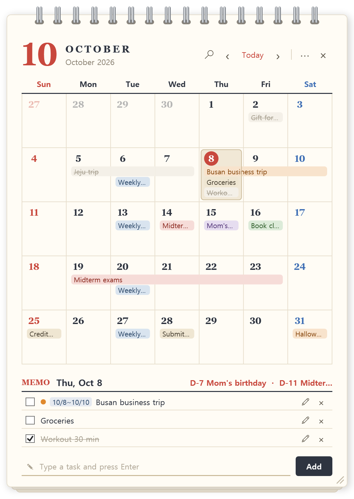

# Desktop Calendar (myCalendar)

**English** · [한국어](README.md)

A **desk calendar + to-do** widget that lives on your Windows desktop.
It never covers other windows, and it stays visible even when you press `Win + D` (Show desktop) — it behaves like part of the desktop itself.

<p align="center">
  
</p>

## Features

- **Pinned to the desktop** — never covers your apps; always there when you look at the desktop.
- **Events inside the day cells** — see what's planned at a glance.
- **Multi-day events** — trips and exam weeks are drawn as continuous bars.
- **Repeating events** — weekly meetings, monthly bills, yearly birthdays.
- **Colors** and **D-day** — color-code events and count down to the important ones.
- **Drag to move** and **search** — drag an event to another day; find events by name.
- **Korean public holidays** (optional) — including lunar holidays and substitute holidays. Off by default in English; turn it on from the menu.
- **To-dos** — add, check off, edit, delete.
- **English / 한국어** — switch the language from the menu.
- **Background transparency**, **remembers position and size**, **starts with Windows**, **update notifications**.

## Download and run

> Requirements: **Windows 10 / 11 (64-bit)** — nothing else to install.

1. **[Download CalendarWidget.exe](https://github.com/geunlee00/myCalendar/releases/latest/download/CalendarWidget.exe)**
   (or get the latest `CalendarWidget.exe` from **Releases**)
2. Move the file to a folder where it will stay, e.g. `Documents\CalendarWidget\`.
   Start-with-Windows remembers this location, so avoid moving the file afterwards.
3. **Double-click** the file.
   If **"Windows protected your PC"** appears, click **More info → Run anyway**
   (the app is not code-signed).
4. The calendar appears at the bottom-right of your desktop. Minimize your windows or press `Win + D` to see it.

On first run, **Start with Windows** is turned on. You can turn it off from the `⋯` menu.

## How to use

### Calendar

| To do this | Do this |
|---|---|
| Change month | `‹` `›` buttons, or the **mouse wheel** over the calendar |
| Go back to today | **Today** button |
| Pick a day | **Click** a day (clicking a faded day of the previous/next month switches to that month) |
| Pick a range of days | **Drag** from the first day to the last, or click the first day and **Shift+click** the last |
| See all events of a day | Hover over the day ("+N" next to the date means more events than fit) |

### To-dos and events

| To do this | Do this |
|---|---|
| Add | Pick a day (or range), type in the box at the bottom, press **Enter** |
| Add quickly | **Double-click** a day to jump to the input box |
| Check off | The **checkbox** on the left — it gets crossed out and moves down |
| Move to another day | **Drag** the event in the calendar onto another day (the drop target is previewed in blue) |
| Edit | The **✎** button, **double-click** the title in the list, or **double-click** the event in the calendar |
| Delete | **×** on the right (or **Delete** in the editor) |

### Editing an event (repeat, color, D-day)

The memo area turns into an editor:

| Item | Description |
|---|---|
| Title | Rename the event |
| Date | While editing, **click or drag on the calendar** to change the date or range |
| Repeat | None / Weekly (same weekday) / Monthly (same day) / Yearly (same month and day) |
| Color | One of six colors, used in the calendar and the list |
| Show D-day | Shows the countdown (e.g. `D-12`) in the memo header and the list |

**Save** (or Enter) applies the changes; **Cancel** (or Esc) discards them.

- Monthly events on a day that doesn't exist in a month (e.g. the 31st) appear on the **last day** of that month; yearly events on Feb 29 appear on **Feb 28** in common years.
- Repeating events show a **repeat icon (↻)** instead of a checkbox. Deleting or moving one affects all occurrences.

### Search

Click the **magnifier**, type part of an event name. Upcoming events are listed first (nearest first), then past ones; repeating events show their next occurrence.
Click a result (or press Enter) to jump to that day. **Esc** closes the search.

### Position and size

| To do this | Do this |
|---|---|
| Move | **Drag** the top area (below the rings, or the big month number) |
| Resize | Drag any **edge or corner** (the bottom-right has a hatched grip) |
| Reset | `⋯` menu → **Reset position and size** |

### `⋯` menu

| Item | Description |
|---|---|
| Start with Windows | Launch the calendar when you sign in |
| Reset position and size | Back to the bottom-right of the primary monitor |
| Check for updates | Check now; opens the download page if a new version exists |
| Language (언어) | English / 한국어. Defaults to your Windows display language |
| Show Korean public holidays | Mark Korean public holidays in red. Off by default when the app starts in English |
| Background transparency | 0–100%. Text and dates stay readable |
| Quit | Close the calendar (same as **×**) |

## Updating

When a new version is released, a red **Update** badge appears at the top (checked at startup and once a day).

1. Click **Update** to open the download page and download `CalendarWidget.exe`.
2. **Quit** the calendar.
3. **Replace** the old file with the new one (same folder, same name).
4. Run it again.

Your events and settings are stored separately, so nothing is lost.

## FAQ

**I can't see the calendar.**
It sits on the desktop, behind your windows. Press `Win + D` or minimize your windows.

**Nothing happens when I run it a second time.**
Only one calendar runs at a time; the second launch exits immediately.

**Where is my data? How do I back it up?**
In `%LOCALAPPDATA%\CalendarWidget` (paste this into the File Explorer address bar):
`tasks.json` (events) and `settings.json` (position, size, transparency, language). Copy this folder to back up.
A damaged file is never overwritten; it is kept as `tasks.json.broken-<date>`.

**What does it send over the internet?**
Only a request to GitHub asking for the latest version number. No events or personal data are sent.
The calendar works fine offline.

**Can it show holidays of my country?**
Not yet — only Korean public holidays are supported, and they are off by default in English.

**A Korean holiday is missing.**
Temporary holidays (e.g. election days) can't be known in advance and aren't shown.

## Uninstall

1. Turn off **Start with Windows** in the `⋯` menu.
2. **Quit** the calendar.
3. Delete `CalendarWidget.exe`.
4. To delete your events too, delete the `%LOCALAPPDATA%\CalendarWidget` folder.

## For developers

Requires the [.NET 10 SDK](https://dotnet.microsoft.com/download).

```powershell
git clone https://github.com/geunlee00/myCalendar.git
cd myCalendar
dotnet run
```

Single-file build that runs without installing .NET:

```powershell
dotnet publish -p:PublishProfile=win-x64
# output: bin\publish\CalendarWidget.exe
```

Pushing a tag that starts with `v` (e.g. `v1.2.0`) makes GitHub Actions build the executable and publish a release.

The widget is embedded into the desktop icon layer (`SHELLDLL_DefView`). This was verified on Windows 11 24H2,
where windows placed directly in `Progman` are no longer composited.

## License

Released under the [MIT License](LICENSE). Anyone may use, modify, and redistribute it; please keep the copyright and license notice.
