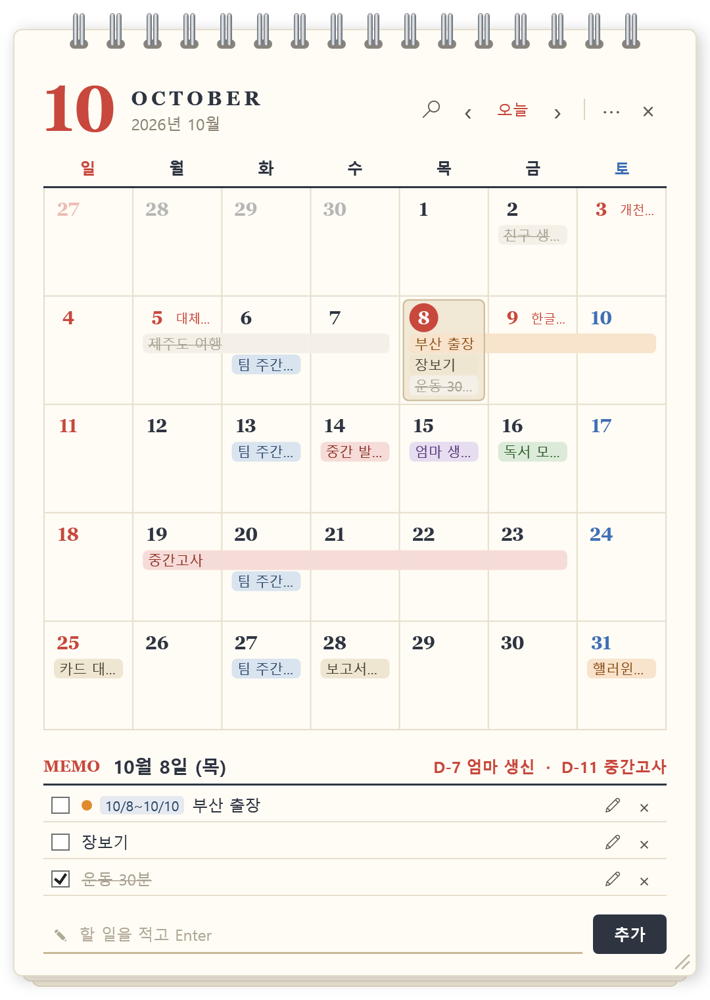

# 바탕화면 달력 (myCalendar)

[English](README.en.md) · **한국어**

바탕화면에 붙여 두고 쓰는 **탁상 달력 + 할 일** 위젯입니다.
다른 창 위로 올라오지 않고, `Win + D`(바탕화면 보기)를 눌러도 사라지지 않아 바탕화면의 일부처럼 쓸 수 있습니다.

<p align="center">
  
</p>

## 주요 기능

- **바탕화면에 고정** — 다른 앱 창을 가리지 않고, 바탕화면을 볼 때 언제나 그 자리에 있습니다.
- **날짜 칸 안에 일정 표시** — 그날 할 일이 달력 칸에 바로 보입니다.
- **여러 날 일정** — 출장·여행처럼 며칠에 걸친 일정을 이어진 막대로 보여 줍니다.
- **반복 일정** — 매주 회의, 매달 카드 대금, 매년 생일처럼 반복되는 일정을 한 번만 등록합니다.
- **색깔 분류**와 **D-day** — 일정마다 색을 붙이고, 중요한 일정까지 남은 날을 보여 줍니다.
- **끌어서 옮기기**와 **검색** — 일정을 다른 날짜로 끌어 놓고, 이름으로 찾습니다.
- **한국 공휴일** — 설날·추석·부처님오신날(음력)과 대체공휴일까지 빨간 날로 표시합니다.
- **할 일 관리** — 추가, 완료 체크(줄 긋기), 편집, 삭제
- **한국어 / English** — 메뉴에서 언어를 바꿀 수 있습니다.
- **배경 투명도** — 0~100%로 조절해 바탕화면 그림과 어울리게 할 수 있습니다.
- **위치·크기 기억**, **Windows 시작 시 자동 실행**
- **새 버전 알림** — 새 버전이 나오면 달력에 빨간 **업데이트** 표시가 뜹니다.

## 내려받기와 실행

> 필요한 것: **Windows 10 / 11 (64비트)** — 따로 설치할 프로그램은 없습니다.

1. **[CalendarWidget.exe 내려받기](https://github.com/geunlee00/myCalendar/releases/latest/download/CalendarWidget.exe)**
   (또는 오른쪽의 **Releases**에서 최신 버전의 `CalendarWidget.exe`)
2. 내려받은 파일을 계속 둘 폴더로 옮깁니다. 예: `문서\CalendarWidget\`
   - 자동 실행이 이 위치를 기억하므로, 실행한 뒤에는 파일을 옮기지 않는 것이 좋습니다.
3. 파일을 **더블클릭**합니다.
   - **"Windows의 PC 보호"** 창이 뜨면 **추가 정보 → 실행**을 누르세요.
     (개인이 만든 프로그램이라 전자 서명이 없어서 나오는 안내입니다.)
4. 바탕화면 오른쪽 아래에 달력이 나타납니다. 다른 창을 내리거나 `Win + D`를 누르면 보입니다.

처음 실행하면 **Windows 시작 시 자동 실행**이 켜집니다. 원하지 않으면 `⋯` 메뉴에서 끄세요.

## 사용법

### 달력 보기

| 하고 싶은 일 | 방법 |
|---|---|
| 다른 달 보기 | 위쪽 `‹` `›` 버튼, 또는 달력 위에서 **마우스 휠** |
| 오늘로 돌아오기 | 위쪽 **오늘** 버튼 |
| 날짜 고르기 | 날짜 칸을 **클릭** (흐린 앞뒤 달 날짜를 누르면 그 달로 넘어갑니다) |
| 그날 일정 모두 보기 | 날짜 칸에 마우스를 올려 두기 (칸에 다 안 들어가면 날짜 숫자 옆에 "+N"으로 표시합니다) |

오늘 날짜에는 **빨간 동그라미**, 고른 날짜에는 **베이지색 칸**이 표시됩니다.

### 할 일

| 하고 싶은 일 | 방법 |
|---|---|
| 할 일 추가 | 날짜를 고르고 아래 입력칸에 적은 뒤 **Enter** (또는 **추가** 버튼) |
| 바로 입력하기 | 날짜 칸을 **더블클릭**하면 입력칸으로 바로 이동합니다 |
| 여러 날 일정 추가 | 시작 날짜를 누른 채 끝 날짜까지 **끌거나**, 시작 날짜를 누르고 **Shift+클릭**으로 끝 날짜를 고른 뒤 입력 |
| 완료 표시 | 왼쪽 **체크박스** — 줄이 그어지고 목록 아래로 내려갑니다 |
| 다른 날짜로 옮기기 | 달력의 일정을 누른 채 **다른 날짜로 끌어 놓기** (놓을 자리가 파랗게 미리 보입니다) |
| 편집하기 | 목록의 **✎** 버튼, 할 일 이름 **더블클릭**, 또는 달력의 일정 **더블클릭** |
| 삭제 | 오른쪽 **×** (또는 편집 화면의 **삭제**) |

여러 날 일정은 달력에 이어진 막대로, 메모장에는 `10/8~10/10`처럼 기간과 함께 표시됩니다.
기간을 고르면 메모장에는 그 기간에 걸친 일정이 모두 보입니다.

### 일정 편집 (반복·색·D-day)

편집하기를 누르면 메모장 자리가 편집 화면으로 바뀝니다.

| 항목 | 설명 |
|---|---|
| 제목 | 일정 이름을 고칩니다 |
| 날짜 | 편집하는 동안 **달력을 누르거나 끌면** 그 날짜(기간)로 바뀝니다 |
| 반복 | 안 함 / 매주(같은 요일) / 매달(같은 날) / 매년(같은 월·일) |
| 색 | 6가지 색 중에서 고릅니다. 달력과 목록에 그 색으로 표시됩니다 |
| D-day 표시 | 켜면 메모장 위쪽 오른쪽과 목록에 `D-12`처럼 남은 날이 보입니다 |

**저장**(또는 Enter)으로 반영하고, **취소**(또는 Esc)로 되돌립니다.

- 매달 31일처럼 그 달에 없는 날은 **그 달 마지막 날**에, 매년 2월 29일은 평년에 **2월 28일**에 표시합니다.
- 반복 일정은 완료 체크 대신 **반복 표시(↻)**가 붙습니다. 지우면 모든 회차가 함께 지워집니다.
- 반복 일정을 끌어서 옮기면 모든 회차가 함께 옮겨집니다.

### 검색

위쪽 **돋보기** 버튼을 누르고 일정 이름을 적으면 찾은 일정이 날짜와 함께 나옵니다.
앞으로 올 일정이 가까운 순서로 먼저, 지난 일정이 뒤에 나오고, 반복 일정은 다음 회차 날짜가 보입니다.
결과를 누르면(또는 Enter) 그 날짜로 이동합니다. **Esc**로 닫습니다.

바꿀 때마다 바로 저장되므로 따로 저장할 필요가 없습니다.

### 위치·크기

| 하고 싶은 일 | 방법 |
|---|---|
| 옮기기 | 위쪽(스프링 아래 여백이나 큰 월 숫자 부분)을 **끌기** |
| 크기 바꾸기 | 오른쪽 아래 모서리의 **빗금**을 끌기 |
| 처음 위치로 | `⋯` 메뉴 → **위치·크기 처음으로** |

옮긴 위치와 크기는 다음에 켤 때도 그대로입니다.

### `⋯` 메뉴

| 항목 | 설명 |
|---|---|
| Windows 시작 시 자동 실행 | 체크하면 컴퓨터를 켤 때 달력이 자동으로 뜹니다 |
| 위치·크기 처음으로 | 주 모니터 오른쪽 아래의 처음 자리로 되돌립니다 |
| 업데이트 확인 | 새 버전이 있는지 바로 확인합니다. 새 버전이 있으면 내려받기 페이지가 열립니다 |
| 언어 (Language) | 한국어 / English. 처음에는 Windows 표시 언어를 따릅니다 |
| 대한민국 공휴일 표시 | 공휴일을 빨간 날로 표시할지 정합니다. 처음에는 한국어면 켜지고 영어면 꺼져 있습니다 |
| 배경 투명도 | 슬라이더로 0~100% 조절. 투명해도 글자와 날짜는 또렷하게 남습니다 |
| 끝내기 | 달력을 끕니다 (오른쪽 위 **×**와 같습니다) |

## 업데이트하기

새 버전이 나오면 달력 위쪽에 빨간 **업데이트** 표시가 뜹니다. (켤 때와, 켜 둔 동안 하루 한 번 확인합니다)

1. **업데이트** 표시를 누르면 내려받기 페이지가 열립니다. `CalendarWidget.exe`를 내려받으세요.
2. 달력을 **끝내기**로 끕니다.
3. 내려받은 파일로 **원래 파일을 덮어씁니다** (같은 폴더, 같은 이름).
4. 다시 실행합니다.

할 일과 설정은 다른 폴더에 저장되어 있어서 그대로 남습니다.

## 자주 묻는 질문

**달력이 안 보여요.**
달력은 바탕화면에 붙어 있어서 다른 창 뒤에 있습니다. `Win + D`를 누르거나 창들을 내려 보세요.
그래도 없으면 작업 관리자에서 `CalendarWidget`을 끝낸 뒤 다시 실행해 보세요.

**두 번 실행했는데 아무 일도 없어요.**
이미 켜져 있으면 두 번째 실행은 바로 끝납니다. 달력은 하나만 뜹니다.

**탐색기가 멈췄다가 다시 시작됐어요.**
바탕화면이 다시 준비되면 달력이 몇 초 안에 알아서 다시 붙습니다.

**일정은 어디에 저장되나요? 백업하려면?**
`%LOCALAPPDATA%\CalendarWidget` 폴더에 저장됩니다. (파일 탐색기 주소창에 그대로 입력하면 열립니다)
- `tasks.json` — 할 일
- `settings.json` — 위치·크기, 투명도

이 폴더를 복사해 두면 백업이 됩니다. 파일이 손상되면 지우지 않고 `tasks.json.broken-날짜`로 남겨 둡니다.

**인터넷으로 무엇을 보내나요?**
새 버전 확인을 위해 GitHub에 "최신 버전이 무엇인지"만 물어봅니다. 할 일이나 설정 같은 개인 정보는 보내지 않습니다.
인터넷이 연결되어 있지 않아도 달력은 그대로 쓸 수 있습니다.

**공휴일이 하나 빠졌어요.**
선거일 같은 임시공휴일은 미리 알 수 없어 표시되지 않습니다.

## 지우기

1. `⋯` 메뉴에서 **Windows 시작 시 자동 실행**을 끕니다.
2. **끝내기**로 달력을 끕니다.
3. `CalendarWidget.exe` 파일을 지웁니다.
4. 일정까지 지우려면 `%LOCALAPPDATA%\CalendarWidget` 폴더도 지웁니다.

---

## 개발자용

### 직접 빌드하기

[.NET 10 SDK](https://dotnet.microsoft.com/download)가 필요합니다.

```powershell
git clone https://github.com/geunlee00/myCalendar.git
cd myCalendar
dotnet run
```

설치 없이 실행되는 파일 하나로 묶으려면:

```powershell
dotnet publish -p:PublishProfile=win-x64
# 결과: bin\publish\CalendarWidget.exe
```

### 새 버전 내기

`v`로 시작하는 태그를 올리면 GitHub Actions가 실행 파일을 만들어 Releases에 올립니다.

```powershell
git tag v1.0.1
git push origin v1.0.1
```

### 구조

| 파일 | 역할 |
|---|---|
| `App.xaml.cs` | 시작, 중복 실행 막기, 설정 불러오기, 바탕화면에 붙이기·다시 붙이기 |
| `CalendarView.xaml(.cs)` | 달력 화면과 동작 (날짜 칸, 할 일 목록, 메뉴, 투명도) |
| `Services/DesktopWidgetHost.cs` | 바탕화면 아이콘 층(`SHELLDLL_DefView`) 안에 투명 자식 창을 만들어 위젯을 그림 |
| `Services/KoreanHolidays.cs` | 한국 공휴일·대체공휴일 계산 (음력 포함) |
| `Services/TaskStore.cs`, `SettingsStore.cs`, `AppDataFile.cs` | 할 일·설정 저장 |
| `Services/AutoStart.cs` | Windows 시작 프로그램 등록 |
| `Services/UpdateChecker.cs` | GitHub 최신 릴리스 버전 확인 |
| `Services/Localization.cs` | 한국어·영어 화면 문구 |
| `Models/CalendarTask.cs` | 일정 데이터, 반복 회차 계산, D-day |
| `TaskPalette.cs` | 일정 색깔별 칩·막대·점 색 |
| `app.manifest` | 바탕화면과 같은 DPI 모드, Windows 8 이상 선언 (투명 자식 창에 필요) |

바탕화면에 붙는 방식은 Windows 11 24H2에서 확인했습니다.
24H2부터는 `Progman`에 바로 넣은 창이 화면에 그려지지 않아, 아이콘 층 안에 넣고 있습니다.

## 라이선스

[MIT 라이선스](LICENSE)로 공개합니다. 누구나 자유롭게 쓰고, 고치고, 다시 배포할 수 있습니다.
배포할 때는 저작권 표시와 라이선스 문구를 함께 넣어 주세요.
